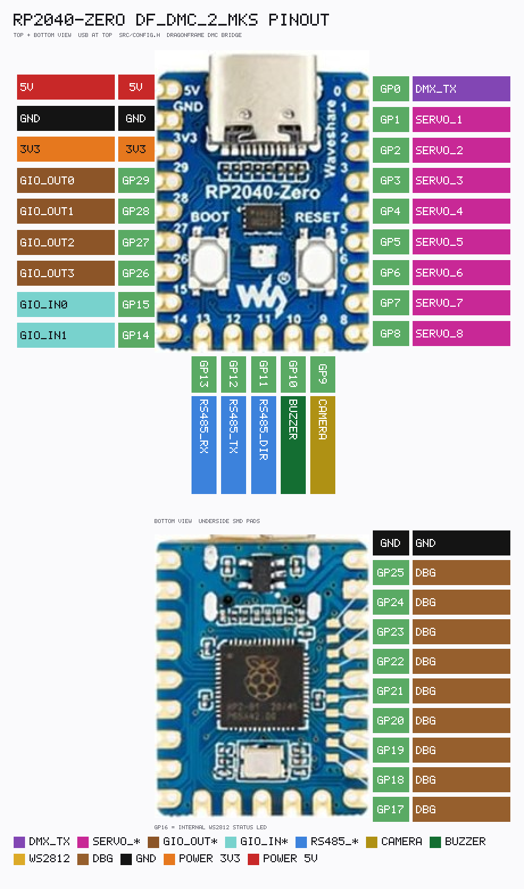

# DF_DMC_2_MKS pin map

[← Index](README.md)

Pins are fixed in `src/config.h`. Board: **Waveshare RP2040-Zero**.



Regenerate: `python tools/render_pinout.py` → [pinout.txt](pinout.txt) + `img/pinout.png`.

| Pad | Function |
|-----|----------|
| GP0 | DMX512 TX (PIO UART 250000 8N2 + BREAK/MAB). No PWM mirror of DMX levels |
| GP1–GP8 | `SERVO_1`..`SERVO_8` hobby PWM (~306 Hz) |
| GP9 | Camera shutter, open-collector, active low |
| GP10 | Buzzer, active high |
| GP11 | RS485 direction (DE and /RE). High = transmit |
| GP12 | RS485 TX, 256000 8N1 |
| GP13 | RS485 RX |
| GP14 | GIO IN1, pull-up |
| GP15 | GIO IN0, pull-up |
| GP16 | Internal WS2812 status LED |
| GP17–GP25 | Debug. Firmware leaves them as inputs |
| GP26 | GIO OUT3, open-collector |
| GP27 | GIO OUT2 |
| GP28 | GIO OUT1 |
| GP29 | GIO OUT0 |
| USB CDC | Dragonframe DMC |

## MAX485 on 5 V

Use two MAX485 chips. One is the DMX sender. One is the motor bus. They do not share A/B. Power both from the Zero **5V** pad (USB VBUS). Common GND with the Zero. 100 nF across each chip from pin 8 (VCC) to pin 5 (GND).

MAX485 DIP-8: **1 RO**, **2 /RE**, **3 DE**, **4 DI**, **5 GND**, **6 A**, **7 B**, **8 VCC**.

GP0 and GP12 drive DI directly. The MAX485 treats 2 V as a high, so a 3.3 V GPIO is enough. DE and /RE on the motor chip are the same: GP11 high (3.3 V) turns the driver on and the receiver off.

RO on the motor chip swings to 5 V. Do not wire it straight to GP13. The divider below lands near 3.0 V.

### DMX sender

GP0 is TX only. DE and /RE tied to 5 V keep the driver on and the receiver off. RO stays open. XLR3 female toward the fixtures: pin 1 shield/GND, pin 2 Data−, pin 3 Data+. 120 Ω between pin 2 and pin 3 at the last fixture. Servo pins do not follow DMX levels.

```text
  RP2040-Zero                    MAX485                         XLR3 female
  5V  ------------------------  8 VCC
  GND ------------------------  5 GND  ---------------------  pin 1 + shield

  GP0 ------------------------  4 DI

  5V  ----------------------+-  3 DE
                            +-  2 /RE

                                1 RO     leave open

                                7 B   ---------------------  pin 2  Data−
                                6 A   ---------------------  pin 3  Data+

  Last fixture:
       pin 2  ---- 120 Ω ----  pin 3
```

If every fixture stays dark, swap A and B.

### RS485 to the MKS bus

Half duplex, addresses 1–8. The Zero transmits on GP12. GP11 high = talk, low = listen. A to MKS A, B to MKS B, one GND. 120 Ω between A and B at each end of the cable.

```text
  RP2040-Zero                    MAX485                         MKS bus
  5V  ------------------------  8 VCC
  GND ------------------------  5 GND  ---------------------  GND

  GP12 -----------------------  4 DI

  GP11 ---------------------+-  3 DE
                            +-  2 /RE

  GP13 --------[2.2 kΩ]-------  1 RO

                                6 A   ---------------------  A
                                7 B   ---------------------  B

  Each bus end:
       A  ---- 120 Ω ----  B
```

If no drive answers, swap A and B. GP11 must be the pin on both DE and /RE so the receiver is off while the Zero is talking.
